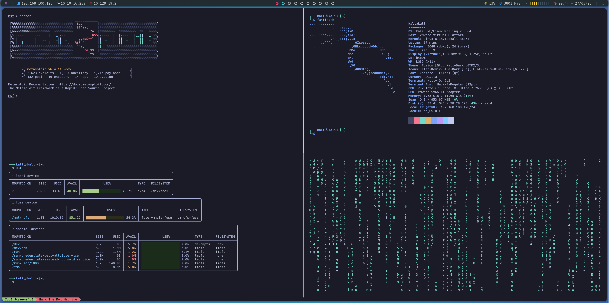
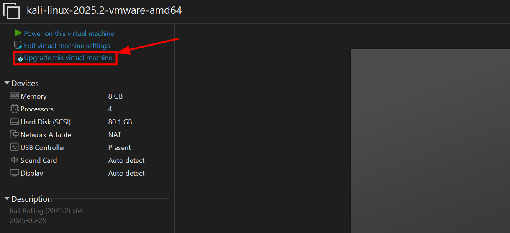
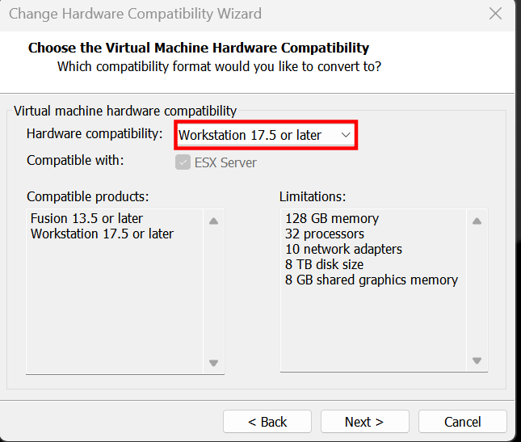
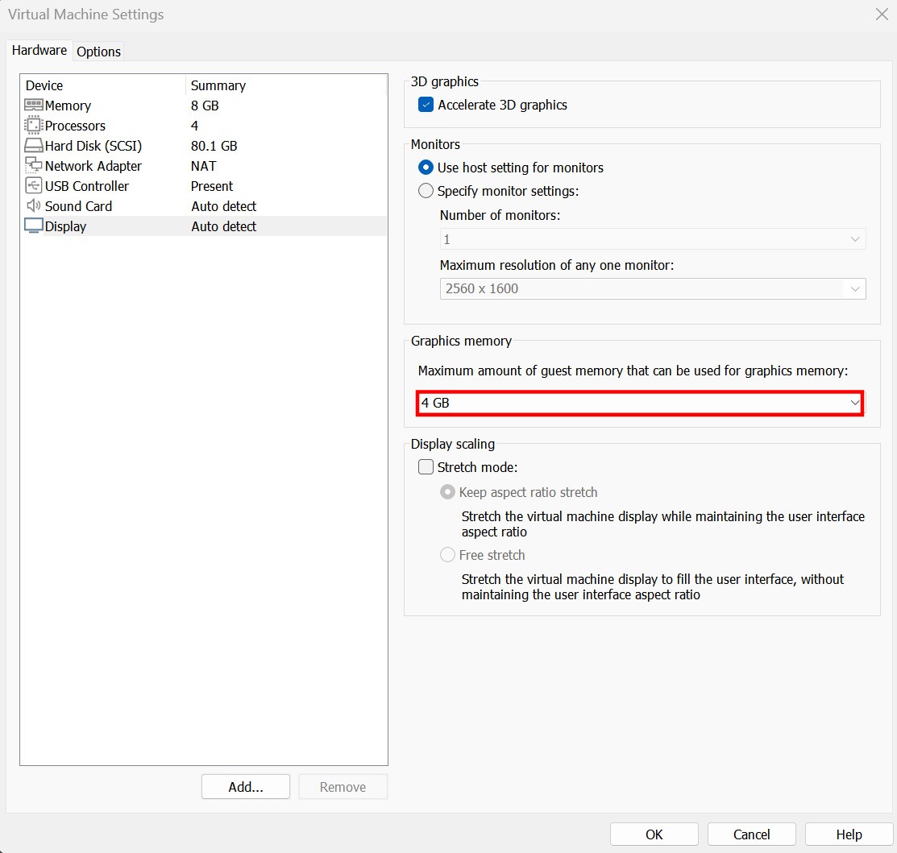

# kali-bspwm
Deploy the best environment for Kali Linux.



## Usage
- You can watch a video tutorial ([CLICK HERE](https://youtu.be/oVgWy5Z9Owc))
- The use of a new/clean Kali Linux 2026 installation is recommended.
- Tested on Kali Linux 2026 with VMware.

### Vmare considerations
If Vmware is being used, you must click on "Upgrade this virtual machine" before power on. Otherwise, Bspwm crash with black screen.





Also you MUST activate your 3d graphics. Otherwise, you probably may not be able to move when bspwm is initialized.



1. clone repo `git clone https://github.com/aldayrruiz/hackerpwm.git`
2. Change directory `cd hackerpwm`
3. Run script `./hackerpwm.sh`
4. **Reboot** and switch to bspwm in the login screen.
5. Run script `./postinstall.sh` to select your keyboard.
6. Enjoy!

Wallpaper is taken from ~/Wallpapers/wallpaper.*

## You will install:
### Main packages
- Hack Nerd Fonts
- Kitty
- Rmux + oh my tmux
- lsd
- fastfetch
- Batcat
- feh
- oh my zsh + plugins
- Rofi
- Bspwm
- Polybar
- Sxhkd
- Picom
- Neovim
- Cmatrix
- Duf

## Key shorcuts

These are a few of key shorcuts, you can see more in `~/.config/sxhkd/sxhkdrc`

```bash
Windows + D                # Open Desktop App search
Windows + W                # Close window
Windows + Enter            # Open Terminal
Windows + Alt + R          # Restart bspwm
Windows + {number}         # Move to Desktop {number}
Windows + Shift + {number} # Send window to Desktop {number}
```

To set a target in polybar, you must execute the next command:

```sh
target 10.10.10.10
```

## Troubleshoot

As this is my personal configuration in vmware, I have this config to adapt a 4k screen. So, if you have a lower resolution
you are going to experience some problems with DPI and font size. This guide will show you how to adapt it to your needs.

### ¿Small font size?
If font size of Polybar (top bar) is too big for you, the config `~/.config/polybar/forest/config.ini` must be changed.

```ini
font-0 = "Hack Nerd Font:size=16;4"
font-1 = "Hack Nerd Font:size=16;3"
```

Modify the value `16` to `12` or something like that.

Otherwise, if you want to change DPI, this also affects font size from everything except polybar, the `~/.Xresources` must be changed. As I said my pixel density is too large so I have `120`, if you see everything too big just change it to a lower value.

```yml
Xft.dpi: 120
```

## Credits
This repo is a fork of [repo](https://github.com/thegoodhackertv/hackerpwm), thank you thegoodhackertv ❤️. Since the repo is not updated and personally I experienced crashes when installing it, I decided to fork it and implement some new features.
